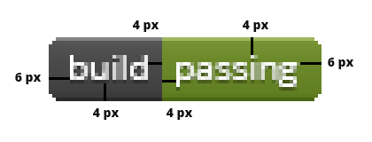

# Shields   

An image server for legible & concise information.

<http://shields.io>

**Installation Instructions**:
[INSTALL.md](INSTALL.md).

**Contributions**:
[CONTRIBUTING.md](CONTRIBUTING.md).

**Specification**:
[SPECIFICATION.md](spec/SPECIFICATION.md).

**License**:
[LICENSE.md](LICENSE.md).

## Problem
Many GitHub repos sport badges for things like:
- [Travis CI](https://travis-ci.org/) build status:

- [Gemnasium](https://gemnasium.com/) dependency checks:

- [Code Climate](http://codeclimate.com):

- [RubyGems](http://rubygems.org) released gem version:

As you can see from the zoomed 400% versions of these badges above, nobody is (really) using the same badge file and at normal size, they're hardly legible. Worst of all, they're completely inconsistent. The information provided isn't of the same kind on each badge. The context is blurry, which doesn't make for a straightforward understanding of how these badges are relevant to the project they're attached to and what information they provide.

## Solution
As you can see below, without increasing the footprint of these badges, I've tried to increase legibility and coherence, removing useless text to decrease the horizontal length in the (likely) scenario that more of these badge thingies crop up on READMEs all across the land.

We have an effort to produce similar-looking SVGs through a web service at
<http://img.shields.io>. That ensures that we are retina-ready.

## Examples

What kind of meta data can you convey using badges?

- test build status: `build | failing`
- code coverage percentage: `coverage | 80%`
- stable release version: `version | 1.2.3`
- package manager release: `gem | 1.2.3`
- status of third-party dependencies: `dependencies | out-of-date`
- static code analysis GPA: `code climate | 3.8`
- [semver](http://semver.org/) version observance: `semver | 2.0.0`
- amount of [gittip](http://gittip.com) donations per week: `tips | $2/week`

## Services using the Shields standard
- [Travis CI](https://github.com/travis-ci/travis-ci/issues/630#issuecomment-38054967)
- [Code Climate](https://codeclimate.com/changelog/510d4fde56b102523a0004bf)
- [Coveralls](https://coveralls.io/r/kaize/nastachku)
- [Gemfury/RubyGems](http://badge.fury.io/)
- [Gemnasium](http://support.gemnasium.com/forums/236528-general/suggestions/5518400-use-svg-for-badges-so-they-still-look-sharp-on-r)
- [GoDoc](https://godoc.org/)
- [Scrutinizer CI](https://scrutinizer-ci.com/)
- [Semaphore](https://semaphoreapp.com)
- [VersionEye][]
- [Read the Docs](https://readthedocs.org/)
- [BadgerBadgerBadger][gem]
- [badges2svg][]
- [reposs][]
- [ruby-gem-downloads-badge][]

[gem]: https://github.com/badges/badgerbadgerbadger
[badges2svg]: https://github.com/bfontaine/badges2svg
[reposs]: https://github.com/rexfinn/reposs
[VersionEye]: https://www.versioneye.com/
[ruby-gem-downloads-badge]: https://github.com/bogdanRada/ruby-gem-downloads-badge/

